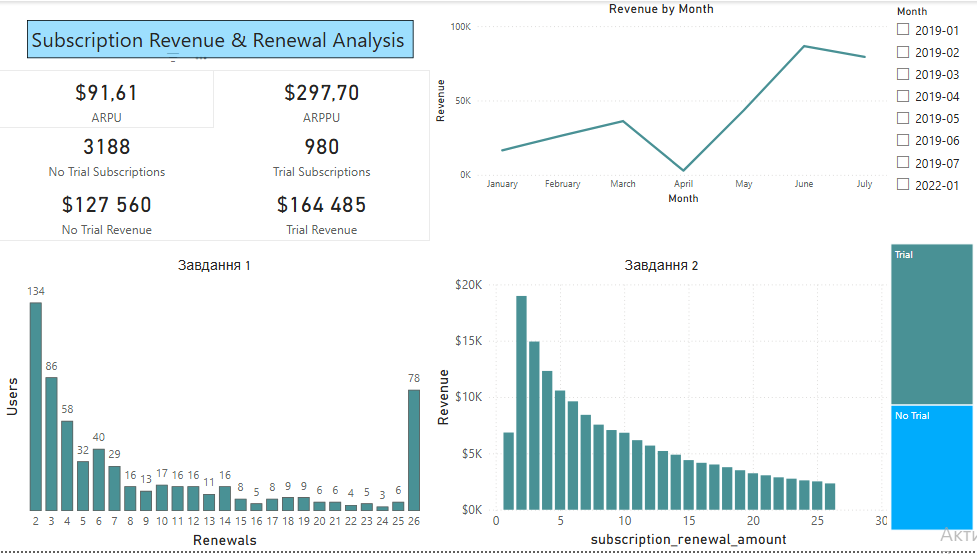
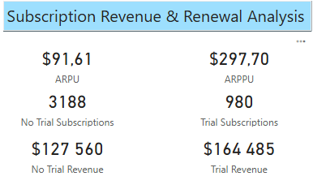
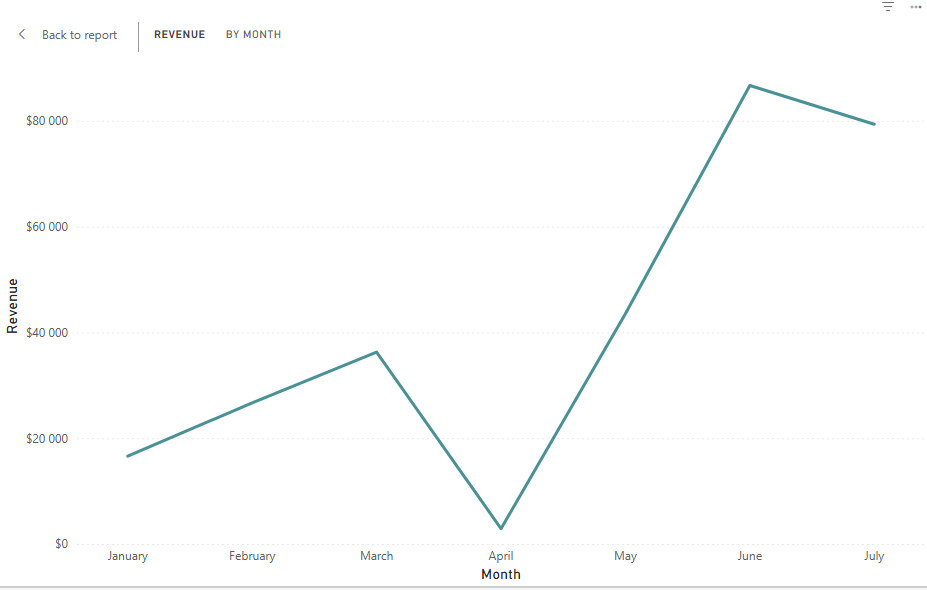
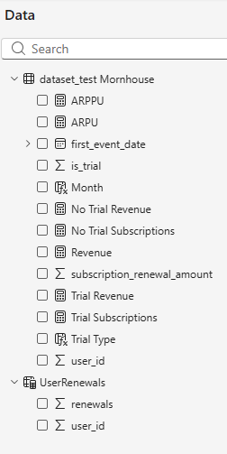

# Subscription Revenue & Renewal Analysis

## Overview
This project presents a Power BI dashboard for analyzing subscription performance, focusing on revenue, user renewals, and differences between trial and non-trial users.

---

## Key Metrics
- **Trial Revenue**
- **No Trial Revenue**
- **ARPU (Average Revenue per User)**
- **ARPPU (Average Revenue per Paying User)**

---

## Dashboard Insights

### 1. Overall Dashboard View
The dashboard provides a high-level overview of subscription performance, including KPIs, revenue trends, and user distribution.

---

### 2. KPI Metrics
Key business metrics allow quick evaluation of monetization performance across trial and non-trial segments.

---

### 3. Revenue Trend Over Time
Revenue trend shows how total income changes over time.

---

### 4. DAX Measures
Custom DAX measures used to calculate revenue and KPI metrics.

---

## Key Insights

### Trial vs No-Trial Comparison
- **No-trial users generate higher revenue per payment ($40)** compared to trial users.
- **Trial users have lower initial revenue ($6.99)** but can generate revenue through future renewals.
- Trial subscriptions act as an entry point, while no-trial subscriptions drive immediate revenue.

### KPI Interpretation
- **Trial Revenue / No Trial Revenue**  
  Show total revenue generated by each segment.

- **ARPU (Average Revenue Per User)**  
  Indicates average revenue across all users.

- **ARPPU (Average Revenue Per Paying User)**  
  Shows how much revenue is generated from paying users only.

- The difference between ARPU and ARPPU reflects that:
  → not all users generate revenue, but paying users contribute more significantly.

---

## Filters
- Month
- Trial / No Trial
- Renewal Number

---

## Tools Used
- Power BI
- DAX 

---

## Files
- `subscription_dashboard.pbix` — Power BI dashboard
- `screenshots/` — dashboard previews
